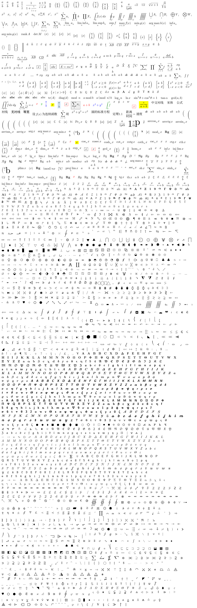

# Texon

<sub>English · [简体中文](README.md)</sub>

**A pure-Java LaTeX math rendering library** — parsing → layout → rendering all happen locally, **with no dependency on Android and no third-party runtime library**.

```java
Texon texon = Texon.load(Assets.dir(new File("assets/fonts")), "metrics", "outlines");
String svg   = texon.svg("\\frac{a}{b}", 48f);          // vector: self-contained SVG
byte[] png   = texon.png("\\sum_{i=1}^{n} a_i", 96f);   // raster: PNG bytes
```

---

## Contents

- [Preview](#preview)
- [Features](#features)
- [Repository layout](#repository-layout)
- [Requirements](#requirements)
- [Quick start](#quick-start)
- [Usage](#usage)
- [Render output](#render-output)
- [Glyph asset format](#glyph-asset-format)
- [Supported LaTeX](#supported-latex)
- [Font assets](#font-assets)
- [FAQ](#faq)
- [License](#license)

---

## Preview



---

## Features

- **Pure Java, zero dependencies**: only `java.*` — runs on desktop, servers and Android, anywhere a JVM exists.
- **Two render backends** over the same layout tree:
  - **Vector**: `svg(...)` → a self-contained SVG string (glyph paths embedded).
  - **Raster**: `png(...)` / `raster(...)` → PNG bytes / ARGB pixels.
- **Sharded assets, loaded on demand**: an index (`.idx`) plus independent shards; hitting a character decompresses only the matching shard (metrics at 4096 code points per shard, outlines at 1024 per shard).
- **Dual CJK family coverage**: `\text{…}` uses the serif family (incl. Chinese), while `\mathsf{…}` / `\texttt{…}` use the sans-serif overlay family; it falls back to the default family automatically when missing.
- **Real-time friendly**: layout cache + cross-frame glyph-path cache + cross-frame glyph-coverage cache + reusable raster sink, suitable for edit previews and continuous rendering.
- **Deterministic build**: the same source plus the same font inputs reproduce the assets byte-for-byte.

---

## Repository layout

```
Texon/
├── assets/
│   └── fonts/
│       ├── metrics.idx                      main font metrics index
│       ├── metrics/<bucket>.bin             metrics shard (symbols / spacing / accents / families)
│       ├── outlines.idx                     main font outlines index
│       ├── outlines/<bucket>.bin            outline shard (incl. serif CJK)
│       ├── cjk-sans-metrics.idx             sans-serif CJK metrics overlay index
│       ├── cjk-sans-metrics/<bucket>.bin    sans-serif CJK metrics overlay shard
│       ├── cjk-sans-outlines.idx            sans-serif CJK outlines overlay index
│       └── cjk-sans-outlines/<bucket>.bin   sans-serif CJK outlines overlay shard
└── java/
    └── texon/latex/engine/core/
        ├── Texon.java              facade: load / svg / raster / png
        ├── Assets.java             asset interface (InputStream open)
        ├── FontMetrics.java        metrics parsing (index + shards)
        ├── GlyphOutlines.java      outline parsing (index + shards)
        ├── Parts.java              shard table / direct lookup
        ├── Tables.java             symbol / spacing / accent / family tables
        ├── ColorTable.java         color table
        ├── lex/
        │   ├── Lexer.java          tokenizing
        │   └── SymbolTable.java    symbol table
        ├── parse/
        │   ├── Ast.java            syntax tree
        │   └── Parser.java         recursive-descent LaTeX subset grammar
        ├── box/
        │   └── Box.java + subclasses   layout intermediate representation
        ├── layout/
        │   ├── Layout.java         typesetting
        │   ├── LayoutCache.java    layout cache
        │   └── *Table.java         accent / delimiter / spacing / family tables
        └── render/
            ├── Renderer.java       layout tree walk
            ├── VectorSink.java     vector drawing interface
            ├── SvgRenderer.java    SVG backend
            ├── SvgPath.java        SVG path parser
            ├── RasterSink.java     raster backend
            ├── GlyphMask.java      glyph coverage mask
            ├── MaskCache.java      glyph coverage cache
            ├── GlyphPaths.java     glyph path cache
            ├── PathSink.java       path sink interface
            ├── Raster.java         ARGB bitmap
            └── Png.java            PNG encoder
```

`java/` is the source root: after compilation the packages / entry classes are `texon.latex.engine.core.*`. `assets/` is the built runtime data, shipped with the repository.

---

## Requirements

- JDK 8+ (officially built with `javac --release 11`; plain Java, so JDK 8 can compile and run it too)
- No third-party JARs, no Android SDK

---

## Quick start

```bash
git clone <your>/Texon.git
cd Texon

# compile the library
mkdir -p out && javac -encoding utf-8 -d out $(find java -name '*.java')

# write an entry point (see below)
cat > Demo.java <<'EOF'
import java.io.File;
import texon.latex.engine.core.Assets;
import texon.latex.engine.core.Texon;
public class Demo {
	public static void main(String[] a) {
		Texon t = Texon.load(Assets.dir(new File("assets/fonts")), "metrics", "outlines");
		System.out.println(t.svg("\\frac{a}{b}", 48f).substring(0, 60) + "...");
	}
}
EOF
javac -encoding utf-8 -cp out -d out Demo.java
java -cp out Demo
```

Running requires `assets/fonts/` to be present in the repository (**shipped**).

---

## Usage

### Loading

```java
import java.io.File;
import texon.latex.engine.core.Assets;
import texon.latex.engine.core.Texon;

// Option 1: load from a directory (pure Java, recommended)
Texon texon = Texon.load(Assets.dir(new File("assets/fonts")), "metrics", "outlines");

// Option 2: any two InputStreams (the index entry points)
Texon texon = Texon.load(metricsStream, outlinesStream);
```

`Assets` is an interface with a single method `InputStream open(String name)`; the library ships with `Assets.dir(File)` (file-system based). You can also implement it as needed to plug in custom storage (Zip, network, Android `AssetManager`, etc.).

### Rendering

```java
// vector: returns a self-contained SVG string
String svg = texon.svg("\\int_0^1 x\\,dx = \\frac{1}{2}", 48f);

// raster pixels
Raster r = texon.raster("\\begin{pmatrix} a & b \\\\ c & d \\end{pmatrix}", 48f, 0xFFFFFFFF);
int width = r.width, height = r.height;
int[] pixels = r.pixels;                       // ARGB8888

// PNG bytes
byte[] png = texon.png("E = mc^2", 96f);

// real-time: reuses the previous frame's sink, good for edit previews / continuous rendering
Raster frame = texon.render(source, pxPerEm, background);
```

---

## Render output

| Method | Returns | Description |
|---|---|---|
| `String svg(latex, pxPerEm)` | `String` | self-contained `<svg>` text, glyph paths embedded |
| `Raster raster(latex, pxPerEm, bg)` | `Raster` | `{width, height, int[] pixels}`, ARGB8888 |
| `byte[] png(latex, pxPerEm[, bg])` | `byte[]` | PNG-encoded bytes |
| `Raster render(latex, pxPerEm, bg)` | `Raster` | reuses the previous frame's sink (real-time) |

---

## Glyph asset format

Binary, **big-endian**. Every shard is a complete, independently parseable unit; the index only records the shard table.

### Index `TXID`

```
magic "TXID" | version i32 | bits i32 | total i32 | parts i32
per part: base i32 | count i32 | flags i32 | nameLen i16 | name ascii
flags bit0 = CORE (carries constants / variant chains / assemblies / table segment; must stay resident)
```

### Metrics shard `TXM2`

```
"TXM2" | rawLen i32 | zlib(body)
body = "TXM1" | unitsPerEm i32 | asc i32 | desc i32 | lineGap i32
       | constCount i32 | consts[]{ keyLen i16, key, value i32 }
       | glyphCount i32 | cp[] i32 | w[] i32 | h/d/ic/il/ta/it/ib[] i16
       | chains[] | hchains[] | asms[]          (CORE shards only)
       | tablesLen i32 | tables[]                (CORE shards only, TXTB table segment)
```

### Outline shard `TXO1`

```
"TXO1" | rawLen i32 | zlib(payload)
payload = n i32 | cp[n] i32 | off[n+1] i32 | data[] (concatenated UTF-8 SVG path strings)
```

Bucketing: metrics `cp >> 12` (4096 code points per shard), outlines `cp >> 10` (1024 per shard).

---

## Supported LaTeX

A recursive-descent parser covers most of the LaTeX math subset (**not** full TeX). Covered categories include:

- **Sub/superscripts, fractions, roots**: `_ ^`, `\frac \dfrac \tfrac \cfrac`, `\sqrt \sqrt[3]`
- **Big operators and limits**: `\sum \prod \int \oint \lim \liminf \argmax \projlim`
- **Auto-sizing delimiters**: `\left( \right]`, `\bigl \Bigl \biggl` …
- **Matrices / environments**: `pmatrix bmatrix matrix array cases align gather`, `\hline \multicolumn`, `\substack \sideset \smashoperator`
- **Accents and decorations**: `\hat \tilde \bar \vec \dot \utilde \overgroup \underbar \overbrace \underbrace`
- **Boxes / colors**: `\boxed \cancel \cancelto \textcolor \colorbox`
- **Text and font families**: `\text \textrm \textsf \texttt`, `\mathbf \mathcal \mathfrak \mathsf \mathtt \mathbb`
- **Arrows / relations / symbols**: `\xrightarrow \xLeftrightarrow \xmapsto`, `\coloneqq \subseteqq \nexists \nleq …`
- **Chinese / CJK**: `\text{中文}` uses serif, `\mathsf{한글}` uses the sans-serif overlay family

---

## Font assets

`assets/fonts/` is shipped with the repository (sharded, compressed, loaded on demand):

```java
Texon texon = Texon.load(Assets.dir(new File("assets/fonts")), "metrics", "outlines");
```

The assets are derived data extracted offline from upstream open-source fonts; provenance and licenses are in [`assets/NOTICE-en.md`](assets/NOTICE-en.md).

---

## FAQ

**Q: At runtime it says `metrics.idx` / `outlines.idx` not found?**
`assets/fonts/` is missing or the path is wrong. Make sure the repository contains `assets/fonts/` (shipped with the library), or point `Assets.dir(new File("correct/path/fonts"))` at the right location.

**Q: Some character renders blank / missing?**
First confirm the glyph exists in the assets; `assets/fonts/` is prebuilt data — see [`assets/NOTICE-en.md`](assets/NOTICE-en.md) for its coverage.

**Q: Can it be used on Android?**
Yes. The library itself has zero Android dependencies; on Android, implement `Assets` over `AssetManager` (`manager.open("fonts/" + name)`) and package `assets/fonts` into the APK.

**Q: How large are the assets?**
About 33MB in total (sharded + compressed). They are not decompressed all at once; only matching shards are loaded on demand.

---

## License

- **Code (`java/`)**: **MIT License**, see [`LICENSE`](LICENSE) in the root directory.
- **Assets (`assets/fonts/`)**: **derived data** from upstream open-source fonts, subject to each source license; see [`assets/NOTICE-en.md`](assets/NOTICE-en.md).