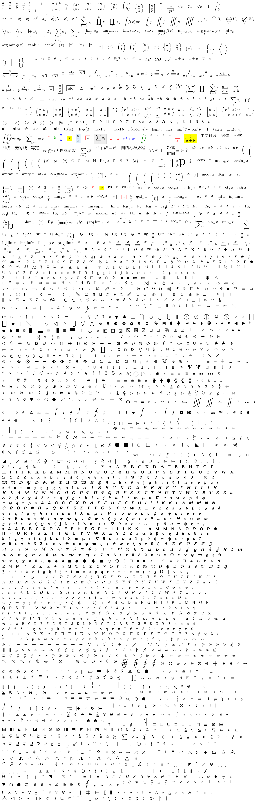

# Texon

<sub>English · [简体中文](README.md)</sub>

**A pure-Java LaTeX math rendering library** — parsing → layout → rendering all happen locally, **with no dependency on Android and no third-party runtime library**.

```java
Texon texon = Texon.load(Assets.dir(new File("assets/fonts")), "metrics", "outlines");
String svg   = texon.svg("\\frac{a}{b}", 48f);          // vector: self-contained SVG
byte[] png   = texon.png("\\sum_{i=1}^{n} a_i", 96f);   // raster: PNG bytes
```

---

## Contents

- [Preview](#preview)
- [Features](#features)
- [Repository layout](#repository-layout)
- [Requirements](#requirements)
- [Quick start](#quick-start)
- [Usage](#usage)
- [Configuration](#configuration)
- [Measurement](#measurement)
- [Batch and streaming layout](#batch-and-streaming-layout)
- [Multiple instances and shared assets](#multiple-instances-and-shared-assets)
- [Prefetch](#prefetch)
- [Render output](#render-output)
- [Glyph asset format](#glyph-asset-format)
- [Supported LaTeX](#supported-latex)
- [Font assets](#font-assets)
- [FAQ](#faq)
- [License](#license)

---

## Preview



---

## Features

- **Pure Java, zero dependencies**: only `java.*` — runs on desktop, servers and Android, anywhere a JVM exists.
- **Two render backends** over the same layout tree:
  - **Vector**: `svg(...)` → a self-contained SVG string (glyph paths embedded).
  - **Raster**: `png(...)` / `raster(...)` → PNG bytes / ARGB pixels.
- **Sharded assets, loaded on demand**: an index (`.idx`) plus independent shards; hitting a character decompresses only the matching shard (metrics at 4096 code points per shard, outlines at 1024 per shard).
- **Dual CJK family coverage**: `\text{…}` uses the serif family (incl. Chinese), while `\mathsf{…}` / `\texttt{…}` use the sans-serif overlay family; it falls back to the default family automatically when missing.
- **Real-time friendly**: layout cache + cross-frame glyph-path cache + cross-frame glyph-coverage cache + reusable raster sink, suitable for edit previews and continuous rendering.
- **Deterministic build**: the same source plus the same font inputs reproduce the assets byte-for-byte.

---

## Repository layout

```
Texon/
├── assets/
│   └── fonts/
│       ├── metrics.idx                      main font metrics index
│       ├── metrics/<bucket>.bin             metrics shard (symbols / spacing / accents / families)
│       ├── outlines.idx                     main font outlines index
│       ├── outlines/<bucket>.bin            outline shard (incl. serif CJK)
│       ├── cjk-sans-metrics.idx             sans-serif CJK metrics overlay index
│       ├── cjk-sans-metrics/<bucket>.bin    sans-serif CJK metrics overlay shard
│       ├── cjk-sans-outlines.idx            sans-serif CJK outlines overlay index
│       └── cjk-sans-outlines/<bucket>.bin   sans-serif CJK outlines overlay shard
└── java/
    └── texon/latex/engine/
        ├── core/                    engine: parse / typeset / render
        │   ├── Texon.java           facade: load / svg / raster / png
        │   ├── TexonAssets.java     shareable outline assets (reused across instances)
        │   ├── LayoutMetrics.java   measurement result: width / height / baseline / inkLeft
        │   ├── Assets.java          asset interface (InputStream open)
        │   ├── FontMetrics.java     metrics parsing (index + shards)
        │   ├── GlyphOutlines.java   outline parsing (index + shards)
        │   ├── Parts.java           shard table / direct lookup
        │   ├── Tables.java          table segment loader (writes into config)
        │   ├── TexonContext.java    runtime context: lookup index + config API
        │   ├── lex/
        │   │   └── Lexer.java       tokenizing
        │   ├── parse/
        │   │   ├── Ast.java         syntax tree
        │   │   └── Parser.java      recursive-descent LaTeX subset grammar
        │   ├── box/
        │   │   └── Box.java + subclasses   layout intermediate representation
        │   ├── layout/
        │   │   ├── Layout.java      typesetting
        │   │   └── LayoutCache.java    layout cache
        │   └── render/
        │       ├── Renderer.java       layout tree walk
        │       ├── VectorSink.java     vector drawing interface
        │       ├── SvgRenderer.java    SVG backend
        │       ├── SvgPath.java        SVG path parser
        │       ├── RasterSink.java     raster backend
        │       ├── GlyphMask.java      glyph coverage mask
        │       ├── MaskCache.java      glyph coverage cache
        │       ├── GlyphPaths.java     glyph path cache
        │       ├── PathSink.java       path sink interface
        │       ├── Raster.java         ARGB bitmap
        │       └── Png.java            PNG encoder
        └── config/                  pure configuration: data and constants only, no algorithms (per instance)
            ├── TexonOptions.java    numeric / capacity / switches
            ├── SymbolTable.java     symbol / command table
            ├── SpacingTable.java    math classes + spacing
            ├── AccentTable.java     accent table
            ├── AccentCompat.java    accent compatibility gaps
            ├── FamilyTable.java     family mapping
            ├── DelimTable.java      delimiter stretch table
            └── ColorTable.java      color table
```

`java/` is the source root: packages are split into `texon.latex.engine.core.*` (engine) and `texon.latex.engine.config.*` (pure config). `assets/` is the built runtime data, shipped with the repository.

---

## Requirements

- JDK 8+ (officially built with `javac --release 11`; plain Java, so JDK 8 can compile and run it too)
- No third-party JARs, no Android SDK

---

## Quick start

```bash
git clone <your>/Texon.git
cd Texon

# compile the library
mkdir -p out && javac -encoding utf-8 -d out $(find java -name '*.java')

# write an entry point (see below)
cat > Demo.java <<'EOF'
import java.io.File;
import texon.latex.engine.core.Assets;
import texon.latex.engine.core.Texon;
public class Demo {
	public static void main(String[] a) {
		Texon t = Texon.load(Assets.dir(new File("assets/fonts")), "metrics", "outlines");
		System.out.println(t.svg("\\frac{a}{b}", 48f).substring(0, 60) + "...");
	}
}
EOF
javac -encoding utf-8 -cp out -d out Demo.java
java -cp out Demo
```

Running requires `assets/fonts/` to be present in the repository (**shipped**).

---

## Usage

### Loading

```java
import java.io.File;
import texon.latex.engine.core.Assets;
import texon.latex.engine.core.Texon;

// Option 1: load from a directory (pure Java, recommended)
Texon texon = Texon.load(Assets.dir(new File("assets/fonts")), "metrics", "outlines");

// Option 2: any two InputStreams (the index entry points)
Texon texon = Texon.load(metricsStream, outlinesStream);
```

`Assets` is an interface with a single method `InputStream open(String name)`; the library ships with `Assets.dir(File)` (file-system based). You can also implement it as needed to plug in custom storage (Zip, network, Android `AssetManager`, etc.).

### Rendering

```java
// vector: returns a self-contained SVG string
String svg = texon.svg("\\int_0^1 x\\,dx = \\frac{1}{2}", 48f);

// raster pixels
Raster r = texon.raster("\\begin{pmatrix} a & b \\\\ c & d \\end{pmatrix}", 48f, 0xFFFFFFFF);
int width = r.width, height = r.height;
int[] pixels = r.pixels;                       // ARGB8888

// PNG bytes
byte[] png = texon.png("E = mc^2", 96f);

// real-time: reuses the previous frame's sink, good for edit previews / continuous rendering
Raster frame = texon.render(source, pxPerEm, background);
```

---

## Configuration

Every output-side and capacity-side knob lives in `config/TexonOptions` — pure data, no algorithms, and **per `Texon` instance**:

```java
TexonOptions opts = new TexonOptions();
opts.pngLevel = 6;               // PNG compression level
opts.rasterSupersample = 2;      // raster supersampling factor
opts.svgPrecision = 3;           // SVG coordinate decimals
opts.layoutCacheCapacity = 512;  // layout cache entry limit
Texon texon = Texon.load(Assets.dir(new File("assets/fonts")), "metrics", "outlines", opts);
```

| Field | Default | Meaning |
|---|---|---|
| `braceAboveGap` / `braceBelowGap` | `35` / `35` | vertical gap between the `\overbrace` / `\underbrace` bar and its content |
| `stackAboveGap` | `193` | baseline gap for `\atop`-style stacks |
| `alignRowGap` | `753` | leading for multi-line environments such as `align` / `gather` |
| `boxPad` | `300` | padding between the frame and the content in `\boxed` / `\fbox` |
| `muDiv` | `18` | 1 mu = `unitsPerEm / muDiv` |
| `delimiterPad` | `100` | extra gap between a delimiter and its content |
| `accentGap` | `0` | extra baseline gap for accent glyphs |
| `errorColor` | `0xFFFF3B30` | ARGB of the error placeholder |
| `layoutCacheCapacity` | `256` | layout cache entry limit |
| `glyphPathsCapacity` | `4096` | glyph path cache entry limit |
| `maskCacheCapacity` | `4096` | glyph coverage cache entry limit |
| `blobBudget` | `8L << 20` | memory budget for resident decompressed outline shards (bytes) |
| `pngLevel` | `6` | PNG compression level, see `java.util.zip.Deflater` |
| `svgPrecision` | `3` | SVG coordinate decimals (`0` = integers only) |
| `svgIdPrefix` | `"g"` | id prefix for SVG glyph paths (avoids clashes when inlining several images) |
| `rasterSupersample` | `2` | samples per pixel (higher = smoother, slower) |
| `pngFilter` | `PNG_FILTER_NONE` | PNG row filter: `PNG_FILTER_NONE` / `0..4` (fixed) / `PNG_FILTER_AUTO` (per-row adaptive) |
| `pngColorMode` | `PNG_COLOR_RGB` | PNG color mode: `PNG_COLOR_RGB` / `PNG_COLOR_AUTO` (grayscale when every pixel is gray) |

The defaults are exactly the values that used to be hard-coded, so **with the default options the output is byte-for-byte identical to the old implementation**; changing any field changes the corresponding artifact — the difference is under your control rather than implicit.

**On PNG row filtering**: measurements show that for formula content **no filtering is optimal** — switching filter types per row destroys the "all-white rows are identical" long-range match, inflating the file by 17%–75% (full 1944×5980 canvas: filter 0 = 720KB, auto = 884KB). Hence the default `PNG_FILTER_NONE`; `PNG_FILTER_AUTO` is opt-in for photo-like content.

**On grayscale**: enabled only when every pixel satisfies `r == g == b`; it saves 12%–15%, but some decoders interpret grayscale PNG as linear gray and shift the look, so it is off by default.

---

## Measurement

`measure(...)` returns `LayoutMetrics`, always in **pixels**:

```java
LayoutMetrics m = texon.measure("\\frac{a+b}{c}", 48f);
m.width;      // total width (including the right italic correction)
m.height;     // total height (ascender + descender)
m.baseline;   // baseline distance from the top
m.inkLeft;    // left ink (may be negative; useful for stroke / crop alignment)
```

Raster results carry the baseline and the ink bounding box too, which helps with inline alignment and tight export:

```java
Raster r = texon.raster("\\sum_{i=1}^{n} a_i", 48f);
r.baseline;                        // baseline position in pixel coordinates
r.inkX; r.inkY; r.inkW; r.inkH;    // bounding box of non-background pixels (inkW = inkH = 0 for an empty formula)
```

The bounding box is tracked in **O(1)** while the raster backend draws — no extra pass; `measure().baseline` and `raster().baseline` are locked to agree by tests.

---

## Batch and streaming layout

Compose several formulas into one line or one paragraph and render them in a single call. The implementation reuses the existing `HBox` / `VBox` + `Renderer`, with **no new rendering code**:

```java
// baseline-aligned horizontal run (atomic spacing by default)
Box line = texon.row(new String[]{"a+b", "=", "c"});

// explicit kerning (font units, same scale as unitsPerEm)
Box line2 = texon.row(new String[]{"x", "y"}, 200);

// baseline-aligned lines + leading; align is VBox.LEFT / VBox.CENTER
Box block = texon.block(new String[]{"\\frac{a}{b}", "= c"}, 400, VBox.LEFT);

// render the whole block
Raster px = texon.raster(block, 48f);                 // white background
Raster tr = texon.raster(block, 48f, 0x00000000);     // transparent background
byte[] png = Png.encode(px, 6, TexonOptions.PNG_FILTER_NONE, TexonOptions.PNG_COLOR_RGB);

// or draw into any VectorSink (SVG backend / a custom one)
texon.draw(block, 0xFF000000, sink);
```

`row` uses `HBox.of` / `HBox.kerned`, while `block` uses `VBox.of` and advances lines with `off[i] = off[i-1] - (depth[i-1] + lineGap + height[i])` — the very same baseline rules the internal typesetter uses.

---

## Multiple instances and shared assets

The outline layer (`GlyphOutlines`, by far the largest part of the assets) can be shared across instances; the metrics layer and the configuration are bound to a `TexonContext` and are **not** shared:

```java
TexonAssets shared = TexonAssets.load(Assets.dir(new File("assets/fonts")), "outlines", 8L << 20);

TexonOptions a = new TexonOptions();
TexonOptions b = new TexonOptions();
b.errorColor = 0xFF0000FF;

Texon t1 = shared.newTexon(Assets.dir(new File("assets/fonts")), "metrics", a);
Texon t2 = shared.newTexon(Assets.dir(new File("assets/fonts")), "metrics", b);
// t1.outlines() == t2.outlines(), but t1.context() != t2.context()
```

- Shares `GlyphOutlines` (112 shards / ~22MB compressed, 56MB decompressed): two instances decompress the outlines once; each instance still owns its own `blobBudget` and options.
- ⚠️ `FontMetrics` **cannot be shared**: the symbol / spacing / accent / family tables are written into `TexonContext` by `Tables.install` at load time, so sharing them across instances would cross the configurations.
- `Texon.load(...)` keeps its meaning (each instance builds its own outlines); sharing is **opt-in**.
- `TexonAssets.addFamily(...)` appends a family to the shared outlines (e.g. the sans-serif CJK overlay family).

---

## Prefetch

Edit-preview scenarios can parse and decode the upcoming formula up front to avoid a first-frame hiccup:

```java
texon.prefetch("\\int_0^1 \\frac{x^2}{1+x}\\,dx");
texon.prefetchAsync(source, executor);   // asynchronous variant
```

It reuses `Renderer.walk` with a **no-op sink**: inside `glyph(cp, …, family, …)` it only calls `metrics.width(cp, family)` and `outlines.path(cp, family)` to trigger shard decoding. `family` is resolved by the typesetter, so there is no need to walk the syntax tree yourself.

---

## Render output

| Method | Returns | Description |
|---|---|---|
| `String svg(latex, pxPerEm)` | `String` | self-contained `<svg>` text, glyph paths embedded |
| `Raster raster(latex, pxPerEm, bg)` | `Raster` | `{width, height, int[] pixels}`, ARGB8888 |
| `byte[] png(latex, pxPerEm[, bg])` | `byte[]` | PNG-encoded bytes |
| `Raster render(latex, pxPerEm, bg)` | `Raster` | reuses the previous frame's sink (real-time) |
| `LayoutMetrics measure(latex, pxPerEm)` | `LayoutMetrics` | size / baseline / ink, see [Measurement](#measurement) |
| `Box box(latex)` | `Box` | parse + typeset, returns the layout tree |
| `Box row(String[] parts[, gap])` | `Box` | baseline-aligned horizontal run, see [Batch and streaming layout](#batch-and-streaming-layout) |
| `Box block(String[] lines, lineGap[, align])` | `Box` | multi-line baseline alignment + leading |
| `Raster raster(Box root, pxPerEm[, bg])` | `Raster` | render an arbitrary layout tree |
| `void draw(Box root, argb, sink)` | — | draw into any `VectorSink` |
| `void prefetch(latex)` / `prefetchAsync(latex, executor)` | — | pre-parse and decode the needed shards, see [Prefetch](#prefetch) |

---

## Glyph asset format

Binary, **big-endian**. Every shard is a complete, independently parseable unit; the index only records the shard table.

### Index `TXID`

```
magic "TXID" | version i32 | bits i32 | total i32 | parts i32
per part: base i32 | count i32 | flags i32 | nameLen i16 | name ascii
flags bit0 = CORE (carries constants / variant chains / assemblies / table segment; must stay resident)
```

### Metrics shard `TXM2`

```
"TXM2" | rawLen i32 | zlib(body)
body = "TXM1" | unitsPerEm i32 | asc i32 | desc i32 | lineGap i32
       | constCount i32 | consts[]{ keyLen i16, key, value i32 }
       | glyphCount i32 | cp[] i32 | w[] i32 | h/d/ic/il/ta/it/ib[] i16
       | chains[] | hchains[] | asms[]          (CORE shards only)
       | tablesLen i32 | tables[]                (CORE shards only, TXTB table segment)
```

### Outline shard `TXO1`

```
"TXO1" | rawLen i32 | zlib(payload)
payload = n i32 | cp[n] i32 | off[n+1] i32 | data[] (concatenated UTF-8 SVG path strings)
```

Bucketing: metrics `cp >> 12` (4096 code points per shard), outlines `cp >> 10` (1024 per shard).

---

## Supported LaTeX

A recursive-descent parser covers most of the LaTeX math subset (**not** full TeX). Covered categories include:

- **Sub/superscripts, fractions, roots**: `_ ^`, `\frac \dfrac \tfrac \cfrac`, `\sqrt \sqrt[3]`
- **Big operators and limits**: `\sum \prod \int \oint \lim \liminf \argmax \projlim`
- **Auto-sizing delimiters**: `\left( \right]`, `\bigl \Bigl \biggl` …
- **Matrices / environments**: `pmatrix bmatrix matrix array cases align gather`, `\hline \multicolumn`, `\substack \sideset \smashoperator`
- **Accents and decorations**: `\hat \tilde \bar \vec \dot \utilde \overgroup \underbar \overbrace \underbrace`
- **Boxes / colors**: `\boxed \cancel \cancelto \textcolor \colorbox`
- **Text and font families**: `\text \textrm \textsf \texttt`, `\mathbf \mathcal \mathfrak \mathsf \mathtt \mathbb`
- **Arrows / relations / symbols**: `\xrightarrow \xLeftrightarrow \xmapsto`, `\coloneqq \subseteqq \nexists \nleq …`
- **Chinese / CJK**: `\text{中文}` uses serif, `\mathsf{한글}` uses the sans-serif overlay family

---

## Font assets

`assets/fonts/` is shipped with the repository (sharded, compressed, loaded on demand):

```java
Texon texon = Texon.load(Assets.dir(new File("assets/fonts")), "metrics", "outlines");
```

The assets are derived data extracted offline from upstream open-source fonts; provenance and licenses are in [`assets/NOTICE-en.md`](assets/NOTICE-en.md).

---

## FAQ

**Q: At runtime it says `metrics.idx` / `outlines.idx` not found?**
`assets/fonts/` is missing or the path is wrong. Make sure the repository contains `assets/fonts/` (shipped with the library), or point `Assets.dir(new File("correct/path/fonts"))` at the right location.

**Q: Some character renders blank / missing?**
First confirm the glyph exists in the assets; `assets/fonts/` is prebuilt data — see [`assets/NOTICE-en.md`](assets/NOTICE-en.md) for its coverage.

**Q: Can it be used on Android?**
Yes. The library itself has zero Android dependencies; on Android, implement `Assets` over `AssetManager` (`manager.open("fonts/" + name)`) and package `assets/fonts` into the APK.

**Q: How large are the assets?**
About 33MB in total (sharded + compressed). They are not decompressed all at once; only matching shards are loaded on demand.

---

## License

- **Code (`java/`)**: **MIT License**, see [`LICENSE`](LICENSE) in the root directory.
- **Assets (`assets/fonts/`)**: **derived data** from upstream open-source fonts, subject to each source license; see [`assets/NOTICE-en.md`](assets/NOTICE-en.md).